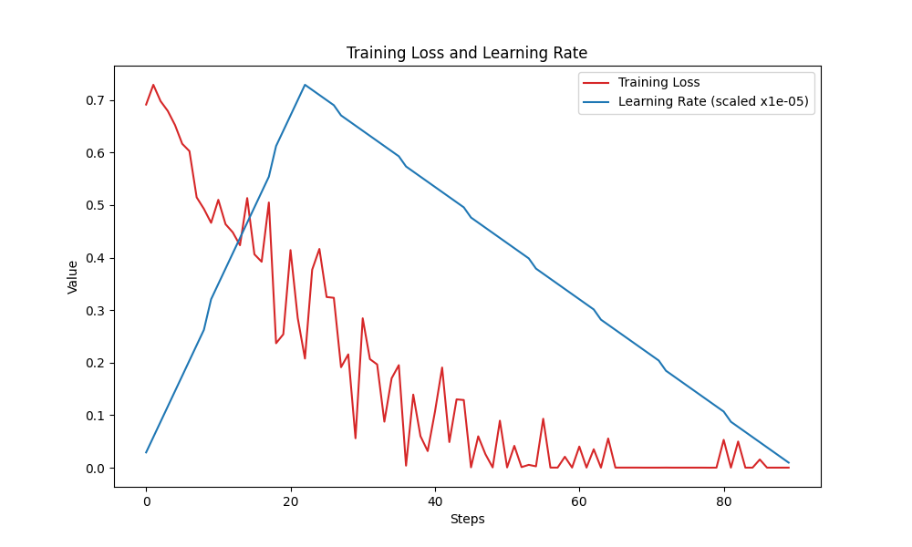

# tweet-sentiment-analysis

This project analyzes tweets posted by random online users. The dataset used was Senitment140, which contains around 1.6 million tweets labelled positive or negative. Other features include date posted and username.

## Initial pipeline
In this project, we perform basic initial visualization on the dataset, followed by cleaning it. This is done by removing stopwords and punctuation marks. Then, lemmatizing is performed to get root words. For feature extraction, TF-IDF transformer is used instead of CountVectorizer. Finally we show accuracy metrics for the model.

## BERT tokenization
Now, we use pre-trained BERT language model to tokenize the randomly sampled 2000 instances of the dataset. Training size can be increased in further versions. Classes are kept balanced to prevent irregularities. BERT uses attention masking during tokenization, which helps improve model performance. Metrics are stored in `plots/` directory. 

- Training Details:
  - Weight Decay: 0.01
  - Epochs: 10
  - Training Batch Size: 8
  - Evaluation steps: 20
  - Evaluation Batch Size: 16
- Evaluation Metrics:
  - Accuracy
  - Precision
  - Recall
  - F1 Score

## Source Files
- `src/data_processing.py`: Handles dataset preprocessing tasks including loading, cleaning, and splitting the data for training and evaluation.
- `src/train.py`: Trains the sentiment analysis model using the preprocessed data, defining model architecture, training parameters, and logging training progress.
- `src/evaluate.py`: Evaluates the trained model on a separate test dataset, computes evaluation metrics, and visualizes the results.
- `src/model.py`: Defines a custom PyTorch dataset `TweetsDataset` for tweet sentiment analysis, while the `get_model` function initializes a BERT-based sequence classification model for the task.

## Dataset
The dataset is in `.csv` format and too big to be uploaded directly to GitHub. Here is the Kaggle link to the dataset: [link](https://www.kaggle.com/datasets/kazanova/sentiment140)
